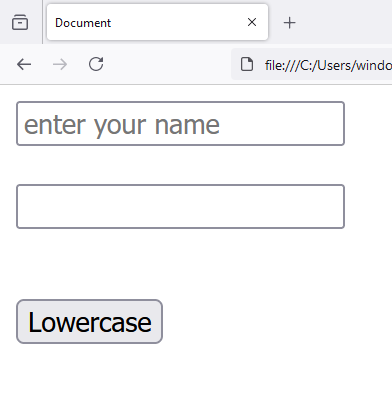
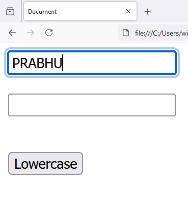
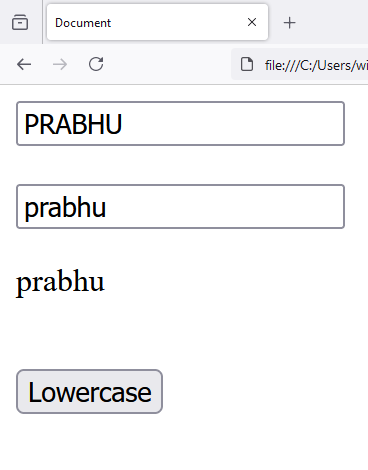

# Chapter - 14 Javascript - User Input Lowercase Proccessing
 
1. `index.html`

```
<!DOCTYPE html>
<html lang="en">
<head>
    <meta charset="UTF-8">
    <meta name="viewport" content="width=device-width, initial-scale=1.0">
    <title>Document</title>
    <script src="main.js"></script>
</head>
<body>
    
    <input type="text" id="name" placeholder="enter your name">

    <br>
    <br>

    <input type="text" id="result1">

    <br>

    <p id="result2"></p>

    <br>

    <input type="button" value="Lowercase" id="lowercase_process">
    
</body>
</html>
```

2. `main.js`

```
window.onload = function()
{
    console.log("Document loaded");

    const name = document.getElementById('name');

    const result1 = document.getElementById('result1');

    const result2 = document.getElementById('result2');
    
    const lowercase_process = document.getElementById('lowercase_process');

    lowercase_process.addEventListener('click', function(){

        result1.value = name.value.toLowerCase();

        result2.innerText = name.value.toLowerCase();

    });


}
```





