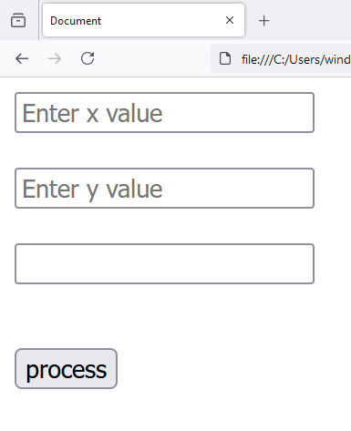
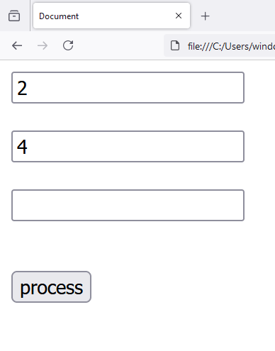
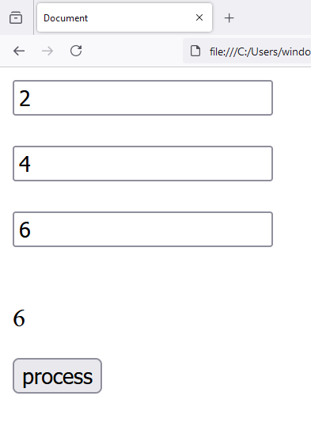

# Chapter - 16 Javascript - User Input Arithmetic Proccessing
 
1. `index.html`

```
<!DOCTYPE html>
<html lang="en">
<head>
    <meta charset="UTF-8">
    <meta name="viewport" content="width=device-width, initial-scale=1.0">
    <title>Document</title>
    <script src="main.js"></script>
</head>
<body>
    
    <input type="text" id="x" placeholder="Enter x value">

    <br>
    <br>

    <input type="text" id="y" placeholder="Enter y value">

    <br>
    <br>

    <input type="text" id="result1">

    <br>
    <br>

    <p id="result2"></p>    

    <input type="button" id="process" value="process">
    
</body>
</html>
```

2. `main.js`

```
window.onload = function()
{
    console.log("Document loaded");

    var x = document.getElementById('x');

    var y = document.getElementById('y');

    var result1 = document.getElementById('result1');

    var result2 = document.getElementById('result2');

    const process = document.getElementById('process');

    process.addEventListener('click', function(){
        
        result1.value = parseInt(x.value) + parseInt(y.value);

        result2.innerText = parseInt(x.value) + parseInt(y.value);
    });
}
```





