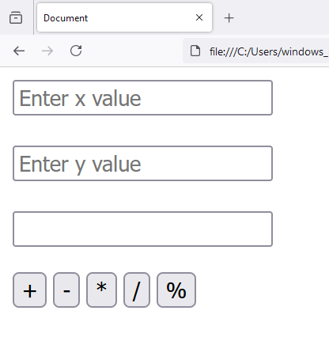
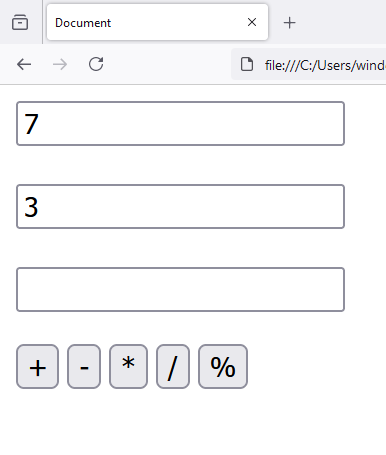
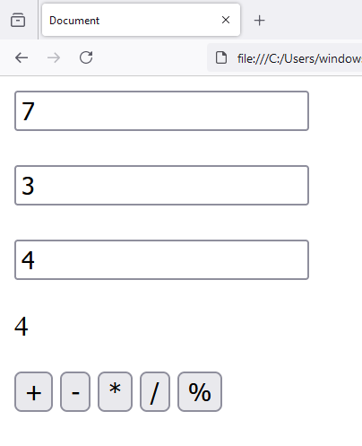
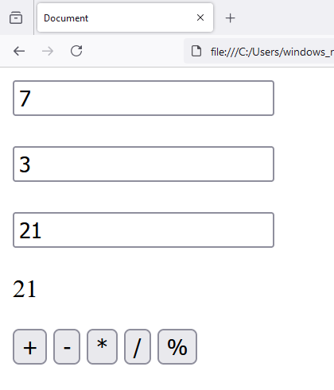
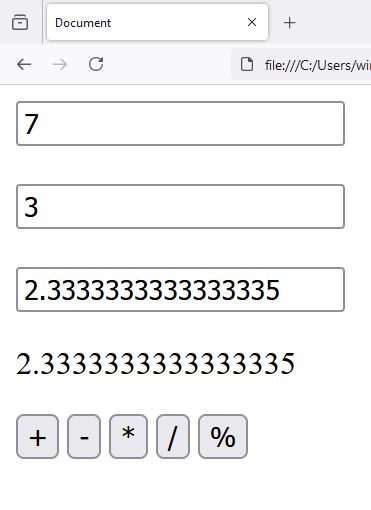
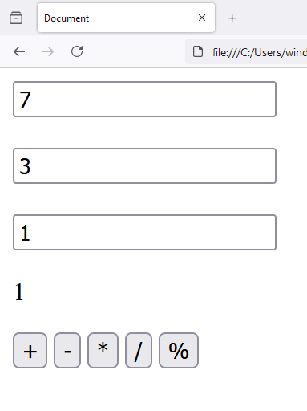

# 17 Javascript - User Input Selection Based Arithmetic Proccessing
 
1. `index.html`

```
<!DOCTYPE html>
<html lang="en">
<head>
    <meta charset="UTF-8">
    <meta name="viewport" content="width=device-width, initial-scale=1.0">
    <title>Document</title>
    <script src="main.js"></script>
</head>
<body>
    
    <input type="text" id="x" placeholder="Enter x value">

    <br>
    <br>

    <input type="text" id="y" placeholder="Enter y value">

    <br>
    <br>    

    <input type="text" id="result1">

    <p id="result2"></p>

    <input type="button" id="addition_button" value="+">

    <input type="button" id="subtraction_button" value="-">
        
    <input type="button" id="multiplication_button" value="*">
        
    <input type="button" id="division_button" value="/">
        
    <input type="button" id="modulus_button" value="%">
    
</body>
</html>
```

2. `main.js`

```
window.onload = function()
{
    console.log("Document loaded");

    var x = document.getElementById('x');

    var y = document.getElementById('y');

    var result1 = document.getElementById('result1');

    var result2 = document.getElementById('result2');

    // addition logic

    var addition_button = document.getElementById('addition_button');

    addition_button.addEventListener('click', function(){
             
        result1.value = parseInt(x.value) + parseInt(y.value);
        
        result2.innerText = parseInt(x.value) + parseInt(y.value);

    });

    // subtraction logic

    var subtraction_button = document.getElementById('subtraction_button');

    subtraction_button.addEventListener('click', function(){
             
        result1.value = parseInt(x.value) - parseInt(y.value);
        
        result2.innerText = parseInt(x.value) - parseInt(y.value);
        
    });
    

    // multiplication logic

    var multiplication_button = document.getElementById('multiplication_button');

    multiplication_button.addEventListener('click', function(){
             
        result1.value = parseInt(x.value) * parseInt(y.value);
        
        result2.innerText = parseInt(x.value) * parseInt(y.value);
        
    });
    

    // division logic

    var division_button = document.getElementById('division_button');

    division_button.addEventListener('click', function(){
             
        result1.value = parseInt(x.value) / parseInt(y.value);
        
        result2.innerText = parseInt(x.value) / parseInt(y.value);
        
    });
    
    // modulus logic

    var modulus_button = document.getElementById('modulus_button');

    modulus_button.addEventListener('click', function(){
             
        result1.value = parseInt(x.value) % parseInt(y.value);
        
        result2.innerText = parseInt(x.value) % parseInt(y.value);
        
    });
}
```












