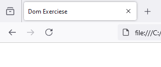

# dom-change-document-title
 
`index.html`

```
<!DOCTYPE html>
<html lang="en">
<head>
    <meta charset="UTF-8">
    <meta name="viewport" content="width=device-width, initial-scale=1.0">
    <title>Document</title>
    <script src="main.js"></script>
</head>
<body>
    
</body>
</html>
```

`main.js`

```
window.onload = function()
{
    
    // html document title
    document.title = "Dom Exerciese"; 
    
}
```

